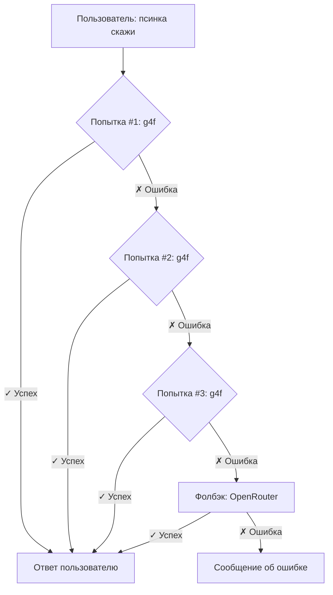

<div align="center">

# 🤖 PsIInka Bot

> 🧪 *Experimental vibecoding project — coding by intuition, no strict rules*

[](https://python.org)
[](https://discord.com/developers/applications)
[](LICENSE)
[](https://github.com/LuwnFM/psinka-bot/releases)
[](#)
[](#)

</div>

---

> ⚠️ **Внимание**  
> Проект в стиле *vibecoding* — версии могут быть нестабильны, код может меняться без предупреждения. Используй на свой страх и риск 🎲

> 🔐 **Конфиденциальность**  
> Файл `.env` с токенами **никогда не загружай в репо**! Используй шаблон `.env.example` и переменные окружения.

---

## 🗂️ Оглавление

<details>
<summary>📋 Нажми, чтобы раскрыть навигацию</summary>

1. [⚡ Быстрый старт](#-быстрый-старт)
2. [⚙️ Архитектура бота](#️-архитектура-бота)
3. [🎮 Справочник команд](#-справочник-команд)
4. [🧪 Тестирование моделей](#-тестирование-моделей)
5. [🗣️ Механика `скажи`](#️-механика-псинка-скажи)
6. [📦 Файлы и данные](#-файлы-и-данные)
7. [🔧 Настройка .env](#-настройка-env)
8. [🚨 Обработка ошибок](#-обработка-ошибок)
9. [🔄 Версии и обновления](#-версии-и-обновления)
10. [❓ FAQ](#-faq)
11. [🎯 Шпаргалка по командам](#-шпаргалка-по-командам)

</details>

---

## ⚡ Быстрый старт

```bash
# 1. Клонируй репо
git clone https://github.com/LuwnFM/psinka-bot.git
cd psinka-bot

# 2. Установи зависимости
pip install -r requirements.txt

# 3. Настрой .env (скопируй из .env.example)
cp .env.example .env
# → Открой .env и вставь свои токены

# 4. Запусти бота
python psinkamain.py
```

> 💡 **Совет для Railway**: Добавь переменную `RAILWAY=true` и укажи `python psinkamain.py` как Start Command.

---

## ⚙️ Архитектура бота

```
C:> SYSTEM_DIAGNOSTIC.EXE /full
[OK] Загрузка модулей...
[✓] g4f connector
[✓] OpenRouter API
[✓] Discord.py handler
[✓] Logging system
```

### 🔄 Схема обработки запроса `псинка скажи`:



> ⚠️ *Mermaid-диаграммы работают на GitHub Desktop, на мобильном могут отображаться как код.*

### 🧠 Система приоритетов моделей:

| 🔥 Уровень | Провайдер | Модели | Критерий |
|------------|-----------|--------|----------|
| **Tier 1** | `g4f` | `gpt-4`, `claude-3`, `llama-3` | Скорость + качество |
| **Tier 2** | `g4f` | `mixtral`, `qwen`, `gemini` | Стабильность |
| **Tier 3** | `OpenRouter` | `free/*` модели | Доступность |
| **Fallback** | Любой | Первая рабочая | "Хоть что-то" |

> 💡 Бот **автоматически переключается** между уровнями при ошибках, таймаутах или нерусском ответе.

---

## 🎮 Справочник команд

### 👤 Базовые команды (для всех)

| Команда | Синтаксис | Описание | Пример ответа |
|---------|-----------|----------|--------------|
| 🐕 `погавкай` | `псинка погавкай` | Проверка пинга бота | `Иди нахуй! У меня пинг 234 мс` |
| 🎲 `кубик` | `псинка кубик <число>` | Бросок кубика 1..N | `🎲 Выпало 17 из 20` |
| 💬 `скажи` | `псинка скажи <вопрос>` | Запрос к ИИ с авто-фолбэком | Ответ от модели + инфо о провайдере |
| 🧪 `тест` | `псинка тест [режим]` | Запуск тестирования моделей | Отчёт по доступным моделям |
| 📊 `лучшие` | `псинка лучшие [тип]` | Статистика успешных комбинаций | Топ-10 рабочих связок |

### 🔐 Команды владельца (`OWNER_ID`)

| Команда | Описание | Файл |
|---------|----------|------|
| 📁 `скачать_логи` | Скачать `bot_errors.log` | Логи ошибок бота |
| 📁 `скачать_историю` | Скачать `test_history.json` | История тестов и статистика |

> 🔐 Проверка: `ctx.author.id == int(os.getenv('OWNER_ID'))`

---

## 🧪 Тестирование моделей (`псинка тест`)

### 📊 Сравнение режимов:

| Режим | 🎯 Провайдеры | 🤖 Модели | ⏱️ Время | 📋 Назначение |
|-------|--------------|----------|---------|--------------|
| 🚀 **Экспресс** | 5 | 1 на провайдер | ~15 сек | Быстрая диагностика |
| ⚡ **Быстрый** | 8 | 11 на провайдер | ~5 мин | Проверка рабочих комбинаций |
| 🆓 **OpenRouter** | 1 | Все free-модели | ~7 мин | Тест только OR free |
| 🔮 **Всё** | 8+1 | Все доступные | ~10 мин | Полное сканирование |
| 🔄 **Авто** | Динамически | Динамически | ~10 мин | Бот сам подбирает |

### 🔍 Алгоритм тестирования:

```python
# Псевдокод механики
for provider in available_providers:
    for model in provider.models:
        try:
            response = await query(provider, model, test_prompt)
            if validate(response):  # русский + не пустой
                save_success(provider, model, response_time)
        except Exception as e:
            save_failure(provider, model, type(e).__name__)
```

### 📈 Структура `test_history.json`:

```json
{
  "test_id": "abc123",
  "timestamp": "2026-03-30T14:30:00Z",
  "mode": "быстрый",
  "results": [
    {
      "provider": "g4f",
      "model": "gpt-4",
      "success": true,
      "response_time_ms": 2340,
      "response_lang": "ru",
      "error": null
    }
  ],
  "stats": {
    "total_combinations": 88,
    "successful": 23,
    "failed": 65,
    "avg_response_time": 3421
  }
}
```

---

## 🗣️ Механика `псинка скажи` — детально

### 🔁 Алгоритм с повторными попытками:

```
[Запрос пользователя]
       │
       ▼
┌─────────────────┐
│ Попытка 1/3     │
│ g4f: gpt-4      │ → ✗ Таймаут (60с)
└────────┬────────┘
         │
         ▼
┌─────────────────┐
│ Попытка 2/3     │
│ g4f: claude-3   │ → ✗ Нерусский ответ
└────────┬────────┘
         │
         ▼
┌─────────────────┐
│ Попытка 3/3     │
│ g4f: llama-3    │ → ✗ Ошибка провайдера
└────────┬────────┘
         │
         ▼
┌─────────────────┐
│ [Фолбэк]        │
│ OpenRouter:     │
│ free/llama-3    │ → ✓ Успех! (2.4с)
└────────┬────────┘
         │
         ▼
[Форматированный ответ пользователю]
```

### ⏱️ Таймауты и лимиты:

| Параметр | Значение | Описание |
|----------|----------|----------|
| `max_retries` | `3` | Попыток на g4f перед фолбэком |
| `retry_timeout` | `60 сек` | Таймаут одной попытки g4f |
| `openrouter_timeout` | `40 сек` | Таймаут запроса к OpenRouter |
| `max_concurrent` | `2` | Лимит параллельных запросов (из `.env`) |

### ✅ Валидация ответа:

Ответ считается **успешным**, если:
1. ✅ Не пустой и не `None`
2. ✅ Содержит кириллицу (проверка на русский язык)
3. ✅ Не содержит ошибок типа `"Unable to load"` или `"Access denied"`

---

## 📦 Файлы и данные

### 🗂️ Структура проекта:

```
psinka-bot/
├── 📄 psinkamain.py          # Основной код бота
├── 📄 requirements.txt       # Зависимости Python
├── 🔐 .env.example           # Шаблон переменных окружения
├── 🚫 .gitignore             # Исключения для Git
├── 📄 README.md              # Этот файл
├── 📄 CHANGELOG.md           # История версий
├── 📋 bot_errors.log         # Логи ошибок (авто-ротация)
├── 📊 test_history.json      # История тестов (авто-очистка)
└── 📁 old versions/          # Архив старых версий
```

### 💾 Ограничения хостинга (Railway):

> ⚠️ **Файловая система временная!**  
> При перезапуске бота **удаляются**:
> - `bot_errors.log` (если >5 MB)
> - `test_history.json` (если >5 MB)
> - Все временные файлы

✅ **Решение**: Используй команды `скачать_логи` и `скачать_историю` для сохранения данных.

---

## 🔧 Настройка .env

| Переменная | Обязательна | Пример | Описание |
|------------|-------------|--------|----------|
| `DISCORD_TOKEN` | ✅ | `MTIz...ABC` | Токен бота из [Discord Developer Portal](https://discord.com/developers/applications) |
| `OPENR_TOKEN` | ✅ | `sk-or-v1-...` | API-ключ от [OpenRouter](https://openrouter.ai) |
| `OWNER_ID` | ✅ | `123456789012345678` | Discord ID владельца (для админ-команд) |
| `USE_PROXY` | ❌ | `true` / `false` | Включить прокси для g4f (нестабильно) |
| `MAX_CONCURRENT` | ❌ | `2` | Лимит параллельных запросов к ИИ |
| `RAILWAY` | ❌ | `true` | Режим хостинга Railway (авто-определение) |

> 🔐 **Важно**: Никогда не коммить `.env` с реальными токенами! Используй `.gitignore`.

---

## 🚨 Обработка ошибок и логирование

### 📋 Типы ошибок:

| Тип ошибки | Действие бота | Пример лога |
|------------|---------------|-------------|
| `TimeoutError` | Повтор → фолбэк на OpenRouter | `⏰ Таймаут попытки #2` |
| `ConnectionError` | Пропуск провайдера | `🔌 Нет соединения с g4f` |
| `InvalidResponse` | Отклонение ответа | `❌ Ответ не на русском` |
| `RateLimit` | Пауза 30 сек + повтор | `⏳ Лимит запросов` |
| `Unknown` | Лог + уведомление владельца | `❓ Неизвестная ошибка: ...` |

### 📄 Формат логов (`bot_errors.log`):

```
[2026-03-30 14:32:18] ERROR in command 'скажи':
  User: LuwnFM#1234 (ID: 987654321)
  Prompt: "Расскажи анекдот"
  Attempt: 2/3
  Provider: g4f/claude-3
  Error: TimeoutError: Request timed out after 60s
  Fallback: OpenRouter/meta-llama-3-8b-instruct:free
  Result: Success (2.4s)
```

---

## 🔄 Версии и обновления

### 📦 Текущая версия: `v0.2.1`

| Версия | Дата | 🎯 Ключевые изменения |
|--------|------|----------------------|
| `v0.2.1` | Мар 2026 | ✅ Скачивание файлов, авто-ротация логов |
| `v0.2` | Мар 2026 | 🌐 Поддержка прокси, улучшенная обработка ошибок |
| `v0.1` | Мар 2026 | 🎉 Первый релиз: базовые команды + g4f + OpenRouter |

### ♻️ Как обновить бота:

```bash
# 1. Останови бота
# 2. Скачай новую версию
git pull origin main

# 3. Установи зависимости (если изменились)
pip install -r requirements.txt

# 4. Перезапусти
python psinkamain.py
```

> 💡 **Совет**: Перед обновлением сделай бэкап `.env` и скачай логи!

---

## ❓ FAQ

<details>
<summary>❓ Почему бот иногда отвечает долго?</summary>

Бот использует **каскадную систему запросов**:
1. Сначала пробует быстрые бесплатные провайдеры (g4f)
2. Если не вышло — переключается на OpenRouter
3. Каждая попытка имеет таймаут (до 60 сек)

✅ **Решение**: Используй `псинка тест экспресс` перед важными запросами.
</details>

<details>
<summary>❓ Как добавить новую модель в приоритет?</summary>

Открой `psinkamain.py` и найди список `PREFERRED_MODELS`:
```python
PREFERRED_MODELS = [
    ("g4f", "gpt-4"),      # 🔥 Приоритет 1
    ("g4f", "claude-3"),   # 🔥 Приоритет 2
    ("openrouter", "free/meta-llama-3"), # 🆓 Фолбэк
]
```
Добавь новую пару `(провайдер, модель)` в нужное место списка.
</details>

<details>
<summary>❓ Можно ли использовать бота в коммерческих проектах?</summary>

✅ **Да**, лицензия MIT разрешает:
- Использовать в коммерческих и личных проектах
- Модифицировать код под свои нужды
- Распространять форки

⚠️ **Но**: 
- Укажи автора (`LuwnFM`) в соответствии с лицензией
- Помни, что g4f и OpenRouter имеют свои условия использования
- Бот в стиле *vibecoding* — тестируй перед продакшеном!
</details>

<details>
<summary>❓ Почему тесты показывают разные результаты?</summary>

Бесплатные провайдеры (особенно g4f) **нестабильны**:
- Модели могут временно отключаться
- Скорость зависит от нагрузки на сервера
- Некоторые провайдеры блокируют частые запросы

✅ **Совет**: Запускай тесты в разное время суток и усредняй результаты.
</details>

---

## 🎯 Шпаргалка по командам (быстрый доступ)

<details>
<summary>📋 Нажми, чтобы скопировать все команды</summary>

```
🐕 ПИНГ:
псинка погавкай

🎲 КУБИК:
псинка кубик 6
псинка кубик 20
псинка кубик 100

💬 ЗАПРОС К ИИ:
псинка скажи Как дела?
псинка скажи Напиши код на Python
псинка скажи Расскажи анекдот

🧪 ТЕСТИРОВАНИЕ:
псинка тест экспресс    # ~15 сек
псинка тест быстрый     # ~5 мин
псинка тест openrouter  # ~7 мин
псинка тест всё         # ~10 мин
псинка тест авто        # умный выбор

📊 СТАТИСТИКА:
псинка лучшие           # все провайдеры
псинка лучшие g4f       # только g4f
псинка лучшие openrouter # только OpenRouter

🔐 ВЛАДЕЛЕЦ:
псинка скачать_логи
псинка скачать_историю
```

</details>

---

<div align="center">

## ⭐ Поддержка проекта

[](https://github.com/LuwnFM/psinka-bot)
[](https://github.com/LuwnFM/psinka-bot/fork)

> 🐕 *Поставь ⭐ — это лучшая поддержка для вибекодера!*  
> 🎨 *Форкай, ломай, чини, создавай — vibecoding это свобода!*

<sub>🤖 *P.S. Даже этот README мог быть сгенерирован ИИ... или нет?* 😉</sub>

</div>