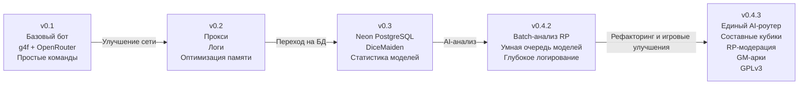
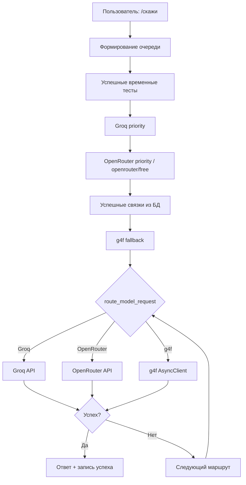
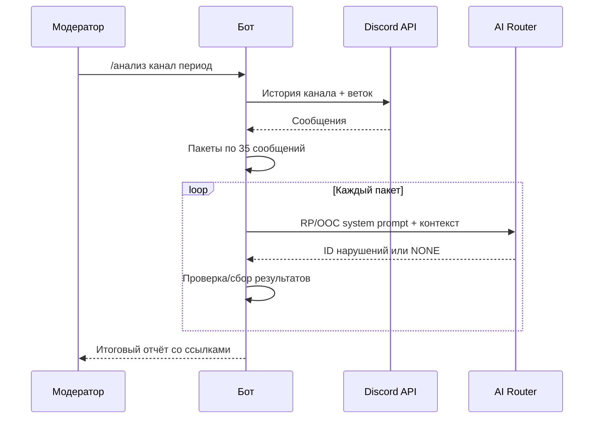
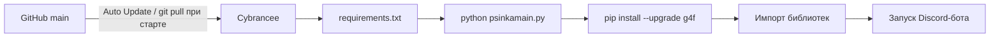

# 🐕 PsIInka Bot — v0.4.3

**PsIInka Bot** — Discord-бот для RP-сервера: ИИ-чат и анализ оффтопа, продвинутые кубики, игровые роллы, аукционные цены, статистика постов, наёмники и RP-модерация без `/`.

> ⚠️ Проект развивается в стиле *vibecoding*: перед обновлением production рекомендуется проверить команды на тестовом канале. Секреты (`DISCORD_TOKEN`, API-ключи, `DATABASE_URL`) не должны храниться в GitHub.

## 🌟 Что умеет бот

### 🧠 `/скажи` и маршрутизация ИИ
- Единый роутер для **Groq → OpenRouter → g4f fallback**.
- Приоритеты дополняются успешными моделями из PostgreSQL/Neon и временными результатами тестов.
- Существующие списки исключённых моделей сохранены и применяются к нужным провайдерам.
- OpenRouter использует `openrouter/free` как устойчивый бесплатный маршрут.
- `g4f` автоматически обновляется через PyPI **при каждом запуске**, до первого `import g4f`.
- Если PyPI временно недоступен, бот продолжает запуск с уже установленной версией `g4f`.

### 🔍 `/анализ`
- Сканирует канал и доступные ветки.
- Пакетно отправляет сообщения ИИ и возвращает ссылки на найденный оффтоп.
- Формат пользовательской выдачи сохранён.
- Оффтоп определяется **по смыслу и контексту**, а не только по `((скобкам))` или `//`.
- Короткая реплика сама по себе не считается нарушением: короткое RP-действие/реплика персонажа должны игнорироваться, а короткие неигровые/OOC-фразы могут быть найдены и без специальных маркеров.

### 🎲 `/кубик`
Поддерживает составные выражения и подробный результат каждого броска:

- `1d6+1d4`
- `2d6+1d8+5`
- `4d6 k3+1d8`
- `2d10 r2+1d6 e6+3`
- `1d20+5; 2d6+1d4`
- алиасы: `attack`, `+d20`, `-d20`, `stat`, `save`, `dndstats`

Модификаторы: keep/drop (`k`, `kh`, `kl`, `d`, `dl`, `dh`), reroll (`r`, `ir`), explode (`e`, `ie`), target (`t`). Каждая формула через `;` выводится **отдельно** и не складывается с соседними.

### 🏠 Игровые роллы
- `Недвижкаролл` — география недвижимости + качество.
- `Качестворолл` — качество предмета.
- `/наёмник` — поиск/ролл по Excel-базе профессий, специализаций и навыков.
- Остальные ролевые механики и формулы, не оговорённые отдельно, сохранены.

`Недвижкаролл` и `Качестворолл` используют одну 9-уровневую шкалу:

| Качество | Шанс |
|---|---:|
| Ужасное | 2% |
| Плохое | 5% |
| Ниже среднего | 10% |
| Приемлемое | 14% |
| Нормальное | 34% |
| Хорошее | 20% |
| Очень хорошее | 10% |
| Отличное | 4% |
| Шедевр | 1% |

### 💰 `/цены`
- Повторные **номера лотов** считаются как отдельные записи.
- Защита от реального дубля действует только по одному и тому же Discord `message_id`.
- В отчёте отдельно показываются повторные номера лотов (засчитаны) и повторные Discord-сообщения (пропущены).

### 📊 `/подсчёт_постов`
- Сохраняет общее соотношение длинных/коротких ГМ-постов.
- Дополнительно показывает длинные/короткие посты **по каждой найденной GM-арке отдельно**.
- Остальная логика и общая выдача подсчёта не заменялись.

### 🛡️ RP-модерация без `/`
Модераторские действия произносятся обычными RP-фразами. Для команды над участником можно поставить `@упоминание` перед фразой либо ответить фразой на его сообщение.

Справка в Discord:

```text
Огласи устав Гвардии
```

| Действие | RP-фраза | Доступ |
|---|---|---|
| Темница: выдать роль `Спит` | `Ты отправляешься в темницу на 15 минут за причина` | Администратор / Гвардеец / Старший Гвардеец |
| Темница: снять `Спит` | `Ты освобождаешься из темницы за причина` | Администратор / Гвардеец / Старший Гвардеец |
| Карцер: Discord timeout | `Ты отправляешься в карцер на 15 минут за причина` | Администратор / Старший Гвардеец / Глава Гвардии Фаервелла |
| Освободить из Карцера | `Ты освобождаешься из карцера за причина` | Администратор / Старший Гвардеец / Глава Гвардии Фаервелла |
| Kick | `Ты изгоняешься из Фаервелла за причина` | Только Администратор |
| Unban | `Врата Фаервелла вновь открыты для USER_ID за причина` | Администратор / Глава Гвардии Фаервелла |
| Выдать роль | `На тебя возлагается знак @Роль за причина` | Только Администратор |
| Снять роль | `С тебя снимается знак @Роль за причина` | Только Администратор |

Отдельной команды выдачи **бана нет**. Команд очистки сообщений в RP-модерации **нет**.

---

# 🏗 Архитектура и логика

## Сравнительная схема эволюции версий


```mermaid
flowchart LR
    A["v0.1<br/>Базовый бот<br/>g4f + OpenRouter<br/>Простые команды"]
    B["v0.2<br/>Прокси<br/>Логи<br/>Оптимизация памяти"]
    C["v0.3<br/>Neon PostgreSQL<br/>DiceMaiden<br/>Статистика моделей"]
    D["v0.4.2<br/>Batch-анализ RP<br/>Умная очередь моделей<br/>Глубокое логирование"]
    E["v0.4.3<br/>Единый AI-роутер<br/>Составные кубики<br/>RP-модерация<br/>GM-арки<br/>GPLv3"]

    A -->|Улучшение сети| B
    B -->|Переход на БД| C
    C -->|AI-анализ| D
    D -->|Рефакторинг и игровые улучшения| E
```

## Маршрутизация `/скажи`


```mermaid
graph TD
    A[Пользователь: /скажи] --> B[Формирование очереди]
    B --> C[Успешные временные тесты]
    C --> D[Groq priority]
    D --> E[OpenRouter priority / openrouter/free]
    E --> F[Успешные связки из БД]
    F --> G[g4f fallback]
    G --> H{route_model_request}
    H -->|Groq| I[Groq API]
    H -->|OpenRouter| J[OpenRouter API]
    H -->|g4f| K[g4f AsyncClient]
    I --> L{Успех?}
    J --> L
    K --> L
    L -->|Да| M[Ответ + запись успеха]
    L -->|Нет| N[Следующий маршрут]
    N --> H
```

> `/анализ` использует тот же роутер, но сохраняет свой порядок: **БД → временные успехи → Groq → OpenRouter → g4f**.

## Логика `/анализ`


```mermaid
sequenceDiagram
    participant U as Модератор
    participant B as Бот
    participant D as Discord API
    participant AI as AI Router

    U->>B: /анализ канал период
    B->>D: История канала + веток
    D-->>B: Сообщения
    B->>B: Пакеты по 35 сообщений
    loop Каждый пакет
        B->>AI: RP/OOC system prompt + контекст
        AI-->>B: ID нарушений или NONE
        B->>B: Проверка/сбор результатов
    end
    B-->>U: Итоговый отчёт со ссылками
```

## Деплой GitHub → Cybrancee


```mermaid
flowchart LR
    A[GitHub main] -->|Auto Update / git pull при старте| B[Cybrancee]
    B --> C[requirements.txt]
    C --> D[python psinkamain.py]
    D --> E[pip install --upgrade g4f]
    E --> F[Импорт библиотек]
    F --> G[Запуск Discord-бота]
```

---

# 📋 Команды

## Slash-команды

В текущем коде зарегистрированы:

- `/скажи`
- `/кубик`
- `/погавкай`
- `/статус`
- `/тест`
- `/анализ`
- `/цены`
- `/скачать_анализ`
- `/скачать_ошибки`
- `/скачать_бд`
- `/очистить_бд`
- `/записать_тест`
- `/напиши`
- `/напиши_юзеру`
- `/редактируй`
- `/наёмник`
- `/категории_подсчёта`
- `/роли_подсчёта`
- `/подсчёт_постов`

Часть служебных команд ограничена владельцем/ролью доступа в соответствии с кодом.

## Текстовые игровые команды

- `Недвижкаролл <описание>`
- `Качестворолл <предмет>`
- Темница и освобождение из Темницы — RP-модерация, не игровая механика.

---

# 🚀 Установка и деплой

## Требования

- Python **3.10+**
- `disnake==2.12.0`
- PostgreSQL/Neon — для истории успешных AI-моделей и связанных функций
- Discord Bot Token
- Groq/OpenRouter ключи — опциональны, но повышают стабильность AI-роутинга

## Локальный запуск

```bash
git clone https://github.com/LuwnFM/psinka-bot.git
cd psinka-bot
pip install -r requirements.txt
python psinkamain.py
```

Для локальной разработки можно скопировать `.env.example` в `.env`. Реальный `.env` никогда не коммитьте.

## Cybrancee

Production в этом проекте рассчитан на схему **GitHub → Cybrancee**:

1. В Cybrancee укажите Git repository: `https://github.com/LuwnFM/psinka-bot.git`.
2. Branch: `main`.
3. Включите **Auto Update**, чтобы при старте сервер делал `git pull`.
4. Startup/Bot Python File: `psinkamain.py` (или эквивалентная команда `python psinkamain.py`, если панель просит команду).
5. Все секреты задавайте в **Environment/Startup variables панели Cybrancee**, а не в GitHub.
6. После обновления `main` перезапустите сервер — Cybrancee подтянет новую версию.

### Переменные окружения

| Переменная | Для чего |
|---|---|
| `DISCORD_TOKEN` | Токен Discord-бота |
| `OWNER_ID` | Discord ID владельца |
| `REQUIRED_ROLE_ID` | ID защищённой роли; `0` — использовать fallback по имени роли |
| `GROQ_TOKEN` | Groq API |
| `OPENR_TOKEN` | OpenRouter API |
| `DATABASE_URL` | PostgreSQL / Neon |
| `MAX_CONCURRENT` | Максимум параллельных AI-запросов |
| `PROXY_REFRESH_HOURS` | Период обновления proxy-списка |
| `USE_PROXY` | Разрешить proxy-режим |
| `DEBUG` | Debug-флаг |
| `RAILWAY` | Старый совместимый флаг; на Cybrancee обычно `false`/не нужен |

## Автообновление `g4f`

`requirements.txt` содержит неприкреплённый к версии `g4f`. Дополнительно в начале `psinkamain.py`, **до первого импорта g4f**, запускается:

```text
python -m pip install --upgrade g4f
```

Поэтому перезапуск Cybrancee подхватывает свежий PyPI-релиз. Если сеть/PyPI временно недоступны, бот пытается продолжить работу с установленной версией.

> ⚠️ Это осознанно «rolling latest»: будущая несовместимая версия g4f теоретически может потребовать правку кода.

---

# 📁 Структура runtime-файлов

```text
psinka-bot/
├── psinkamain.py
├── cogs/
│   └── text_admin.py
├── core/
│   └── paths.py
├── data/
│   └── mercenary_command_database_v2.xlsx
├── logs/                 # создаётся на запуске, gitignored
├── state/                # создаётся на запуске, gitignored
├── requirements.txt
├── .env.example
├── README.md
├── CHANGELOG.md
└── LICENSE
```

- `logs/bot_errors.log` — основной лог.
- `logs/analysis_debug.log` — подробный лог `/анализ`.
- `state/test_pending.csv` — временные результаты тестов AI-моделей.
- `state/post_count_settings.json` — настройки подсчёта постов.
- Старые runtime-файлы из корня мигрируют best-effort в новые каталоги.

---

# ✅ Проверки v0.4.3

Перед публикацией v0.4.3 выполнены:

- компиляция/AST-проверка всех Python-файлов;
- проверка уникальности 19 slash-команд;
- целевые тесты нового `/кубик`;
- 5000 автоматически сгенерированных корректных составных dice-формул;
- тесты ошибок/лимитов `/кубик`;
- проверка пагинации больших результатов;
- проверка совпадения весов `Недвижкаролл` и `Качестворолл` — сумма 100%;
- проверка структуры Excel-базы наёмников;
- проверка новых путей `logs/`, `state/`, `data/`;
- проверка отсутствия `.env`, `__pycache__` и архивов в release-дереве;
- статическая проверка RP-модерации, аукционных дублей, GM-статистики и system prompt оффтопа.

Полный end-to-end тест Discord/Groq/OpenRouter/g4f требует реальных токенов, прав сервера и сетевого окружения Cybrancee и поэтому выполняется уже после deployment/restart.

---

# 📜 Лицензия

Проект распространяется по **GNU General Public License v3.0 (GPLv3)**. Полный текст — в [`LICENSE`](LICENSE).

**Разработчик:** LuwnFM
